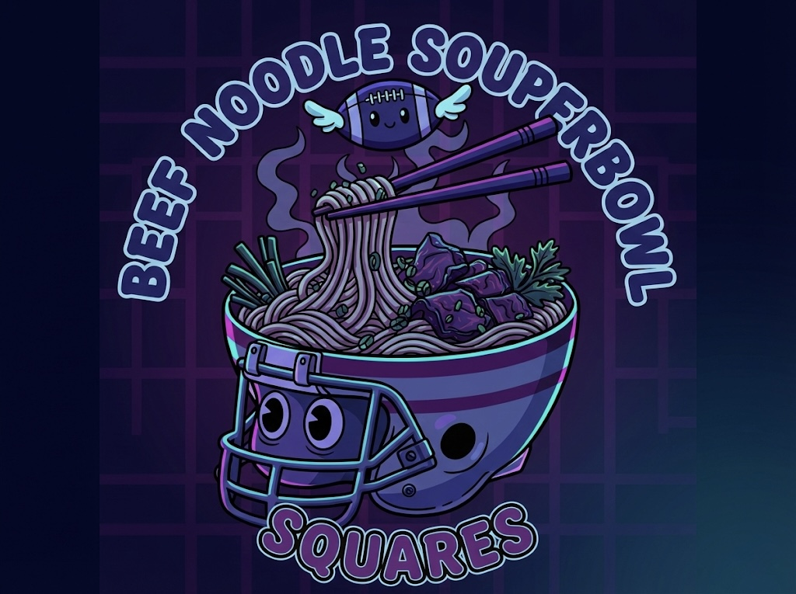
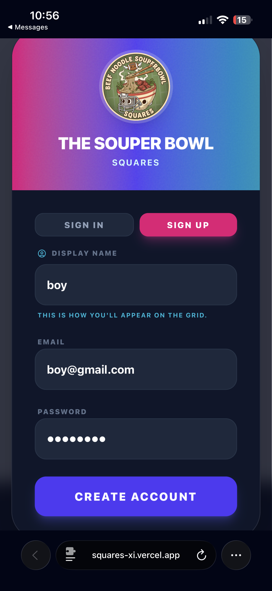
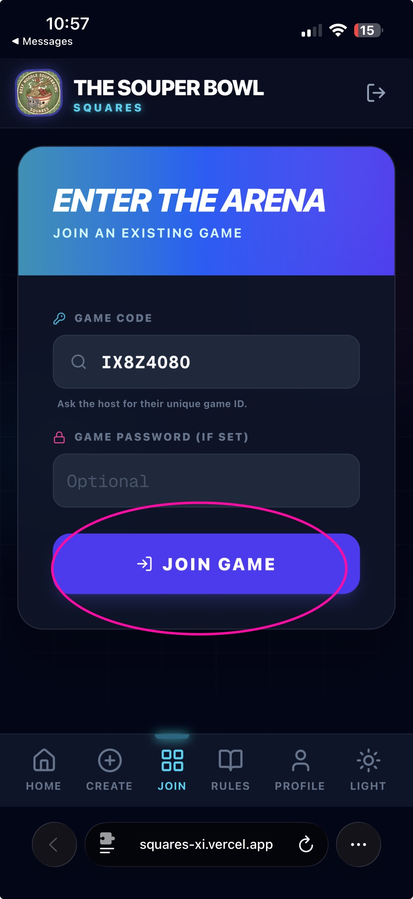
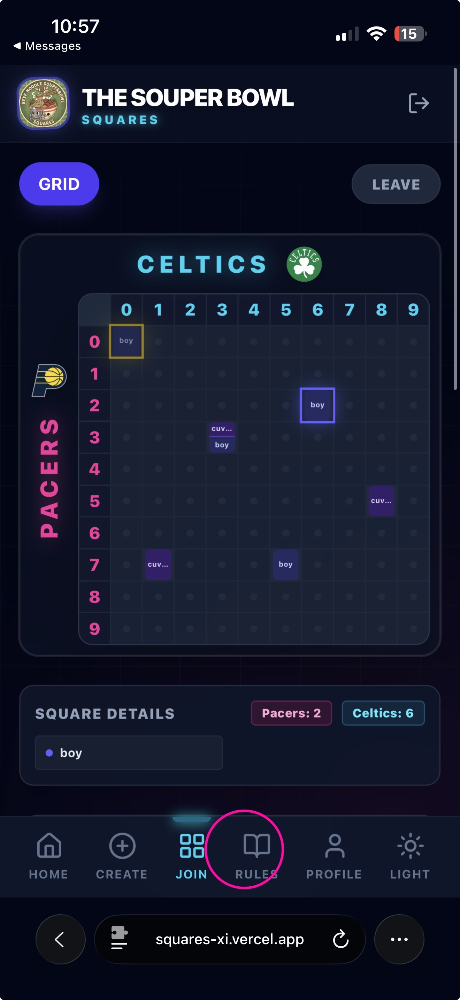
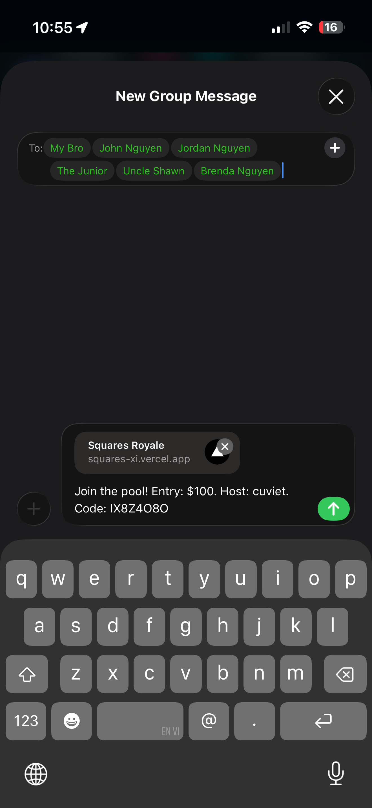

# 🏈 Squares Royale

[](https://nextjs.org/)
[](https://tailwindcss.com/)
[](https://firebase.google.com/)

<div align="center">
  
  
  <h2 className="text-3xl font-bold">The Ultimate Sports Grid Platform</h2>
  <p>Host your game pools with a beautiful, responsive interface that works perfectly on mobile and desktop.</p>
</div>

---

## 🎨 User Guide

Welcome to **Squares Royale**! Whether you're hosting a game or joining one, getting started is easy.

### 1️⃣ How to Sign Up & Sign In

Our secure login system keeps your game history safe.

#### **📝 Sign Up & Login**
Toggle easily between Sign In and Sign Up to get started.

1. Click **"Log In"** to open the secure portal.
2. Toggle between **"Sign In"** and **"Sign Up"**.
3. Enter your details to jump into the action!

<div align="center">
  
</div>

> 💡 **Tip:** You can see all your games in your **Profile** dashboard after logging in!

---

### 🔗 Joining a Game

Received a code? Enter the arena instantly!

1. **Enter Game Code**: Type in the unique code shared by your host (e.g., `IX8Z4080`).
2. **Auto-Fill**: If you clicked a link, this is filled for you!

<div align="center">
  
</div>

---

### 📱 Mobile-First Grid Experience

Our grid is optimized for every device.

<div align="center">
  
</div>

---

### 🚀 Easy Sharing

Invite friends via text or social media with one click. The preview card looks great!

<div align="center">
  
</div>

---

## ✨ Key Features

### 🎮 **Live Game Grid**
- **10x10 Interactive Grid**: Click any open square to claim it.
- **Micro-Symmetrical Layout**: Even with 5+ players on one square, our smart layout keeps it readable!
- **Desktop & Mobile Optimized**: Looks great on your phone or your ultra-wide monitor.

### 🏆 **Real-Time Scoring**
- **Live Updates**: Scores update automatically. No refreshing needed!
- **Winner Highlighting**: See who is winning the current quarter instantly.
- **Payout Ledger**: Track exactly who won what and when.

### 👤 **Player Profiles**
- **Game History**: See every game you've ever played or hosted.
- **One-Click Rejoin**: Jump back into active games from your dashboard.
- **Stats**: Track your wins and total games played.

---

## 🛠️ Developer Setup

If you want to run this code yourself, here is how to get started.

### Installation

1. **Clone the repository**
   ```bash
   git clone https://github.com/NancyCu/squares.git
   cd squares
   ```

2. **Install dependencies**
   ```bash
   npm install
   ```

3. **Run the development server**
   ```bash
   npm run dev
   ```
   Open [http://localhost:3000](http://localhost:3000) to see the app.

### Configuration

This app uses **Firebase** for backend services.
1. Create a project in [Firebase Console](https://console.firebase.google.com/).
2. Enable **Authentication** (Email/Password).
3. Create a **Firestore Database**.
4. Create a `.env.local` file with your credentials:
   ```env
   NEXT_PUBLIC_FIREBASE_API_KEY=...
   NEXT_PUBLIC_FIREBASE_AUTH_DOMAIN=...
   NEXT_PUBLIC_FIREBASE_PROJECT_ID=...
   ```

---

<p align="center">
  Built with ❤️ by <strong>NancyCu</strong>
</p>
